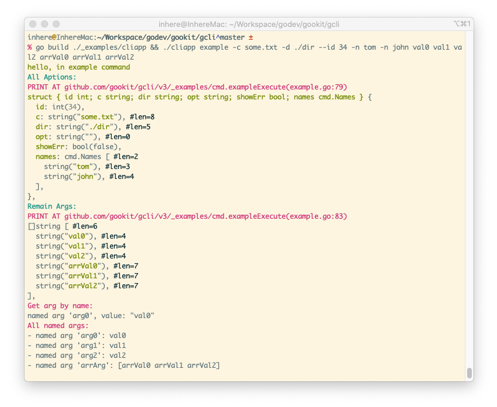
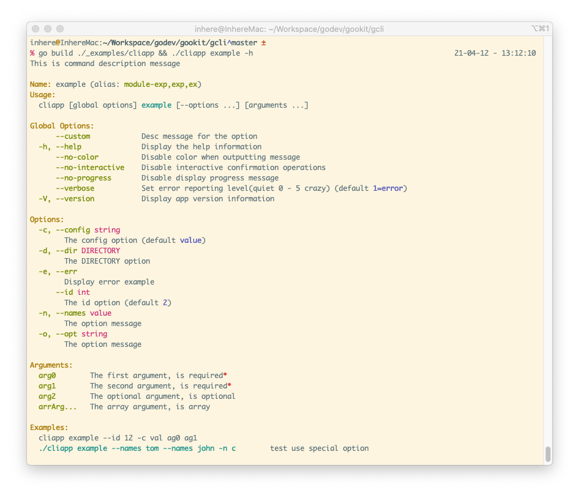

# GCli 


[](https://github.com/gookit/gcli/actions)
[](https://github.com/gookit/gcli)
[](https://travis-ci.org/gookit/gcli)
[](https://app.codacy.com/app/inhere/gcli?utm_source=github.com&utm_medium=referral&utm_content=gookit/gcli&utm_campaign=Badge_Grade_Dashboard)
[](https://pkg.go.dev/github.com/gookit/gcli/v3)
[](https://goreportcard.com/report/github.com/gookit/gcli)
[](https://coveralls.io/github/gookit/gcli?branch=master)

A simple and easy-to-use command-line application and tool library written in Golang.
Including running commands, color styles, data display, progress display, interactive methods, etc.

## [中文说明](README.zh-CN.md)

中文说明请看 **[README.zh-CN](README.zh-CN.md)**

## Screenshots


## Features

- Rich in functions and easy to use
- Support for adding multiple commands and supporting command **aliases**
- Support binding command options from structure
    - example `flag:"name=int0;shorts=i;required=true;desc=int option message"`
- Support for adding multi-level commands, each level of command supports binding its own options
- `option/flag` - support option binding `--long`, support for adding short options(`-s`)
  - POSIX-style short flag combining (`-a -b` = `-ab`)
  - Support setting `Required`, indicating a required option parameter
  - Support setting `Validator`, which can customize the validation input parameters
- `argument` - support binding argument to specify name
  - Support `required`, optional, `array` settings
  - It will be automatically detected and collected when the command is run.
- `colorable` - supports rich color output. provide by [gookit/color](https://github.com/gookit/color)
  - Supports html tab-style color rendering, compatible with Windows
  - Built-in `info, error, success, danger` and other styles, can be used directly
- `interact` Built-in user interaction methods: `ReadLine`, `Confirm`, `Select`, `MultiSelect` ...
- `progress` Built-in progress display methods: `Txt`, `Bar`, `Loading`, `RoundTrip`, `DynamicText` ...
- Automatically generate command help information and support color display
- When the command entered is incorrect, a similar command will be prompted(including an alias prompt)
- Supports generation of `zsh` and `bash` command completion script files
- Supports a single command as a stand-alone application

**Flag Options**:

- Options start with `-` or `--`, and the first character must be a letter
- Support long option. eg: `--long` `--long value`
- Support short option. eg: `-s -a value`
- Support define array option
    - eg: `--tag php --tag go` will get `tag: [php, go]`

**Flag Arguments**:

- Support binding named arguemnt
- Support define array argument

## GoDoc

- [godoc for gopkg](https://pkg.go.dev/gopkg.in/gookit/gcli.v2)
- [godoc for github](https://pkg.go.dev/github.com/gookit/gcli/v3)

## Install

```bash
go get github.com/gookit/gcli/v3
```

## Quick start

an example for quick start:

```go
package main

import (
    "github.com/gookit/gcli/v3"
    "github.com/gookit/gcli/v3/_examples/cmd"
)

// for test run: go build ./_examples/cliapp.go && ./cliapp
func main() {
    app := gcli.NewApp()
    app.Version = "1.0.3"
    app.Desc = "this is my cli application"
    // app.SetVerbose(gcli.VerbDebug)

    app.Add(cmd.Example)
    app.Add(&gcli.Command{
        Name: "demo",
        // allow color tag and {$cmd} will be replace to 'demo'
        Desc: "this is a description <info>message</> for {$cmd}", 
        Subs: []*gcli.Command {
            // ... allow add subcommands
        },
        Aliases: []string{"dm"},
        Func: func (cmd *gcli.Command, args []string) error {
            gcli.Print("hello, in the demo command\n")
            return nil
        },
    })

    // .... add more ...

    app.Run(nil)
}
```

## Binding flags

flags binding and manage by builtin `gflag.go`, allow binding flag options and arguments.

### Bind options

gcli support multi method to binding flag options.

#### Use flag methods

Available methods:

```go
BoolOpt(p *bool, name, shorts string, defValue bool, desc string)
BoolVar(p *bool, meta FlagMeta)
Float64Opt(p *float64, name, shorts string, defValue float64, desc string)
Float64Var(p *float64, meta FlagMeta)
Int64Opt(p *int64, name, shorts string, defValue int64, desc string)
Int64Var(p *int64, meta FlagMeta)
IntOpt(p *int, name, shorts string, defValue int, desc string)
IntVar(p *int, meta FlagMeta)
StrOpt(p *string, name, shorts, defValue, desc string)
StrVar(p *string, meta FlagMeta)
Uint64Opt(p *uint64, name, shorts string, defValue uint64, desc string)
Uint64Var(p *uint64, meta FlagMeta)
UintOpt(p *uint, name, shorts string, defValue uint, desc string)
UintVar(p *uint, meta FlagMeta)
Var(p flag.Value, meta FlagMeta)
VarOpt(p flag.Value, name, shorts, desc string)
```

Usage examples:

```go
var id int
var b bool
var opt, dir string
var f1 float64
var names gcli.Strings

// bind options
cmd.IntOpt(&id, "id", "", 2, "the id option")
cmd.BoolOpt(&b, "bl", "b", false, "the bool option")
// notice `DIRECTORY` will replace to option value type
cmd.StrOpt(&dir, "dir", "d", "", "the `DIRECTORY` option")
// setting option name and short-option name
cmd.StrOpt(&opt, "opt", "o", "", "the option message")
// setting a special option var, it must implement the flag.Value interface
cmd.VarOpt(&names, "names", "n", "the option message")
```

#### Use struct tags

```go
package main

import (
	"fmt"

	"github.com/gookit/gcli/v3"
)

type userOpts struct {
	Int  int    `flag:"name=int0;shorts=i;required=true;desc=int option message"`
	Bol  bool   `flag:"name=bol;shorts=b;desc=bool option message"`
	Str1 string `flag:"name=str1;shorts=o,h;required=true;desc=str1 message"`
	// use ptr
	Str2 *string `flag:"name=str2;required=true;desc=str2 message"`
	// custom type and implement flag.Value
	Verb0 gcli.VerbLevel `flag:"name=verb0;shorts=V;desc=verb0 message"`
	// use ptr
	Verb1 *gcli.VerbLevel `flag:"name=verb1;desc=verb1 message"`
}

func main() {
	astr := "xyz"
	verb := gcli.VerbWarn

	cmd := gcli.NewCommand("test", "desc")
	// fs := gcli.NewFlags("test")
	// err := fs.FromStruct(&userOpts{
	err := cmd.FromStruct(&userOpts{
		Str2:  &astr,
		Verb1: &verb,
	})
	fmt.Println(err)
}
```

### Bind arguments

**About arguments**:

- Required argument cannot be defined after optional argument
- Support binding array argument
- The (array)argument of multiple values can only be defined at the end

Available methods:

```go
Add(arg Argument) *Argument
AddArg(name, desc string, requiredAndArrayed ...bool) *Argument
AddArgByRule(name, rule string) *Argument
AddArgument(arg *Argument) *Argument
BindArg(arg Argument) *Argument
```

Usage examples:

```go
cmd.AddArg("arg0", "the first argument, is required", true)
cmd.AddArg("arg1", "the second argument, is required", true)
cmd.AddArg("arg2", "the optional argument, is optional")
cmd.AddArg("arrArg", "the array argument, is array", false, true)
```

can also use `Arg()/BindArg()` add a gcli.Argument object:

```go
cmd.Arg("arg0", gcli.Argument{
	Name: "ag0",
	Desc: "the first argument, is required",
	Require: true,
})
cmd.BindArg("arg2", gcli.Argument{
	Name: "ag0",
	Desc: "the third argument, is is optional",
})
cmd.BindArg("arrArg", gcli.Argument{
	Name: "arrArg",
	Desc: "the third argument, is is array",
	Arrayed: true,
})
```

use `AddArgByRule`:

```go
cmd.AddArgByRule("arg2", "add an arg by string rule;required;23")
```

## New application

```go
app := gcli.NewApp()
app.Version = "1.0.3"
app.Desc = "this is my cli application"
// app.SetVerbose(gcli.VerbDebug)
```

## Add commands

```go
app.Add(cmd.Example)
app.Add(&gcli.Command{
    Name: "demo",
    // allow color tag and {$cmd} will be replace to 'demo'
    Desc: "this is a description <info>message</> for {$cmd}", 
    Subs: []*gcli.Command {
        // level1: sub commands...
    	{
            Name:    "remote",
            Desc:    "remote command for git",
            Aliases: []string{"rmt"},
            Func: func(c *gcli.Command, args []string) error {
                dump.Println(c.Path())
                return nil
            },
            Subs: []*gcli.Command{
                // level2: sub commands...
                // {}
            }
        },
        // ... allow add subcommands
    },
    Aliases: []string{"dm"},
    Func: func (cmd *gcli.Command, args []string) error {
        gcli.Print("hello, in the demo command\n")
        return nil
    },
})
```

## Run application

Build the example application as demo

```bash
$ go build ./_examples/cliapp                                                         
```

**Display version**

```bash
$ ./cliapp --version      
# or use -V                                                 
$ ./cliapp -V                                                     
```


**Display app help**

> by `./cliapp` or `./cliapp -h` or `./cliapp --help`

Examples:

```bash
./cliapp
./cliapp -h # can also
./cliapp --help # can also
```


 **Run command**

Format:

```bash
./cliapp COMMAND [--OPTION VALUE -S VALUE ...] [ARGUMENT0 ARGUMENT1 ...]
./cliapp COMMAND [--OPTION VALUE -S VALUE ...] SUBCOMMAND [--OPTION ...] [ARGUMENT0 ARGUMENT1 ...]
```

Run example:

```bash
$ ./cliapp example -c some.txt -d ./dir --id 34 -n tom -n john val0 val1 val2 arrVal0 arrVal1 arrVal2
```

You can see:



**Display command help**

> by `./cliapp example -h` or `./cliapp example --help`



**Error command tips**


## Generate Auto Completion Scripts

```go
import  "github.com/gookit/gcli/v3/builtin"

    // ...
    // add gen command(gen successful you can remove it)
    app.Add(builtin.GenAutoComplete())

```

Build and run command(_This command can be deleted after success._)：

```bash
$ go build ./_examples/cliapp.go && ./cliapp genac -h // display help
$ go build ./_examples/cliapp.go && ./cliapp genac // run gen command
```

will see:

```text
INFO: 
  {shell:zsh binName:cliapp output:auto-completion.zsh}

Now, will write content to file auto-completion.zsh
Continue? [yes|no](default yes): y

OK, auto-complete file generate successful
```

> After running, it will generate an `auto-completion.{zsh|bash}` file in the current directory,
 and the shell environment name is automatically obtained.
 Of course, you can specify it manually at runtime

Generated shell script file ref： 

- bash env [auto-completion.bash](resource/auto-completion.bash) 
- zsh env [auto-completion.zsh](resource/auto-completion.zsh)

Preview: 


## Write a command

command allow setting fields:

- `Name` the command name.
- `Desc` the command description.
- `Aliases` the command alias names.
- `Config` the command config func, will call it on init.
- `Subs` add subcommands, allow multi level subcommands
- `Func` the command handle callback func
- More, please see [godoc](https://pkg.go.dev/github.com/gookit/gcli/v3)

### Quick create

```go
var MyCmd = &gcli.Command{
    Name: "demo",
    // allow color tag and {$cmd} will be replace to 'demo'
    Desc: "this is a description <info>message</> for command {$cmd}", 
    Aliases: []string{"dm"},
    Func: func (cmd *gcli.Command, args []string) error {
        gcli.Print("hello, in the demo command\n")
        return nil
    },
    // allow add multi level subcommands
    Subs: []*gcli.Command{},
}
```

### Write go file

> the source file at: [example.go](_examples/cmd/example.go)

```go
package main

import (
	"fmt"

	"github.com/gookit/color"
	"github.com/gookit/gcli/v3"
	"github.com/gookit/goutil/dump"
)

// options for the command
var exampleOpts = struct {
	id  int
	c   string
	dir string
	opt string
	names gcli.Strings
}{}

// ExampleCommand command definition
var ExampleCommand = &gcli.Command{
	Name: "example",
	Desc: "this is a description message",
	Aliases: []string{"exp", "ex"}, // 命令别名
	// {$binName} {$cmd} is help vars. '{$cmd}' will replace to 'example'
	Examples: `{$binName} {$cmd} --id 12 -c val ag0 ag1
<cyan>{$fullCmd} --names tom --names john -n c</> test use special option`,
	Config: func(c *gcli.Command) {
	    // binding options
        // ...
        c.IntOpt(&exampleOpts.id, "id", "", 2, "the id option")
		c.StrOpt(&exampleOpts.c, "config", "c", "value", "the config option")
		// notice `DIRECTORY` will replace to option value type
		c.StrOpt(&exampleOpts.dir, "dir", "d", "", "the `DIRECTORY` option")
		// 支持设置选项短名称
		c.StrOpt(&exampleOpts.opt, "opt", "o", "", "the option message")
		// 支持绑定自定义变量, 但必须实现 flag.Value 接口
		c.VarOpt(&exampleOpts.names, "names", "n", "the option message")

      // binding arguments
		c.AddArg("arg0", "the first argument, is required", true)
		// ...
	},
	Func:  exampleExecute,
}

// 命令执行主逻辑代码
// example run:
// 	go run ./_examples/cliapp.go ex -c some.txt -d ./dir --id 34 -n tom -n john val0 val1 val2 arrVal0 arrVal1 arrVal2
func exampleExecute(c *gcli.Command, args []string) error {
	color.Infoln("hello, in example command")

	if exampleOpts.showErr {
		return c.Errorf("OO, An error has occurred!!")
	}

	magentaln := color.Magenta.Println

	color.Cyanln("All Aptions:")
	// fmt.Printf("%+v\n", exampleOpts)
	dump.V(exampleOpts)

	color.Cyanln("Remain Args:")
	// fmt.Printf("%v\n", args)
	dump.P(args)

	magentaln("Get arg by name:")
	arr := c.Arg("arg0")
	fmt.Printf("named arg '%s', value: %#v\n", arr.Name, arr.Value)

	magentaln("All named args:")
	for _, arg := range c.Args() {
		fmt.Printf("- named arg '%s': %+v\n", arg.Name, arg.Value)
	}

	return nil
}
```

- display the command help：

```bash
go build ./_examples/cliapp.go && ./cliapp example -h
```


## Progress display

Package progress provide terminal progress bar display.

Such as: `Txt`, `Bar`, `Loading`, `RoundTrip`, `DynamicText` ...
 
- `progress.Bar` progress bar

Demo: `./cliapp prog bar`


- `progress.Txt` text progress bar

Demo: `./cliapp prog txt`



- `progress.LoadBar` pending/loading progress bar


- `progress.Counter` counter 
- `progress.RoundTrip` round trip progress bar

```text
[===     ] -> [    === ] -> [ ===    ]
```


- `progress.DynamicText` dynamic text message

Examples:

```go
package main

import (
	"time"

	"github.com/gookit/gcli/v3/progress"
)

func main()  {
	speed := 100
	maxSteps := 110
	p := progress.Bar(maxSteps)
	p.Start()

	for i := 0; i < maxSteps; i++ {
		time.Sleep(time.Duration(speed) * time.Millisecond)
		p.Advance()
	}

	p.Finish()
}
```

> more demos please see [progress_demo.go](_examples/cmd/progress_demo.go)

run demos:

```bash
go run ./_examples/cliapp.go prog txt
go run ./_examples/cliapp.go prog bar
go run ./_examples/cliapp.go prog roundTrip
```


## Interactive methods
   
console interactive methods

- `interact.ReadInput`
- `interact.ReadLine`
- `interact.ReadFirst`
- `interact.Confirm`
- `interact.Select/Choice`
- `interact.MultiSelect/Checkbox`
- `interact.Question/Ask`
- `interact.ReadPassword`

Examples:

```go
package main

import (
	"fmt"

	"github.com/gookit/gcli/v3/interact"
)

func main() {
	username, _ := interact.ReadLine("Your name?")
	password := interact.ReadPassword("Your password?")
	
	ok := interact.Confirm("ensure continue?")
	if !ok {
		// do something...
	}
    
	fmt.Printf("username: %s, password: %s\n", username, password)
}
```

### Read Input

read user input message

```go
ans, _ := interact.ReadLine("Your name? ")

if ans != "" {
    color.Println("Your input: ", ans)
} else {
    color.Cyan.Println("No input!")
}
```


### Select/Choice

```go
ans := interact.SelectOne(
    "Your city name(use array)?",
    []string{"chengdu", "beijing", "shanghai"},
    "",
)
color.Comment.Println("your select is: ", ans)
```


### Multi Select/Checkbox

```go
ans := interact.MultiSelect(
    "Your city name(use array)?",
    []string{"chengdu", "beijing", "shanghai"},
    nil,
)
color.Comment.Println("your select is: ", ans)
```


### Confirm Message

```go
if interact.Confirm("Ensure continue") {
    fmt.Println(emoji.Render(":smile: Confirmed"))
} else {
    color.Warn.Println("Unconfirmed")
}
```


### Read Password

```go
pwd := interact.ReadPassword()

color.Comment.Println("your input password is: ", pwd)
```


## CLI Color

> **Terminal color use [gookit/color](https://github.com/gookit/color)** Support windows `cmd.exe` `powerShell`

- Color output display


### Color usage

```go
package main

import (
    "github.com/gookit/color"
)

func main() {
	// simple usage
	color.Cyan.Printf("Simple to use %s\n", "color")

	// internal theme/style:
	color.Info.Tips("message")
	color.Info.Prompt("message")
	color.Warn.Println("message")
	color.Error.Println("message")
	
	// custom color
	color.New(color.FgWhite, color.BgBlack).Println("custom color style")

	// can also:
	color.Style{color.FgCyan, color.OpBold}.Println("custom color style")
	
	// use defined color tag
	color.Print("use color tag: <suc>he</><comment>llo</>, <cyan>wel</><red>come</>\n")

	// use custom color tag
	color.Print("custom color tag: <fg=yellow;bg=black;op=underscore;>hello, welcome</>\n")

	// set a style tag
	color.Tag("info").Println("info style text")

	// prompt message
	color.Info.Prompt("prompt style message")
	color.Warn.Prompt("prompt style message")

	// tips message
	color.Info.Tips("tips style message")
	color.Warn.Tips("tips style message")
}
```

> **For more information on the use of color libraries, please visit [gookit/color](https://github.com/gookit/color)**

## Gookit packages

- [gookit/ini](https://github.com/gookit/ini) Go config management, use INI files
- [gookit/rux](https://github.com/gookit/rux) Simple and fast request router for golang HTTP 
- [gookit/gcli](https://github.com/gookit/gcli) build CLI application, tool library, running CLI commands
- [gookit/event](https://github.com/gookit/event) Lightweight event manager and dispatcher implements by Go
- [gookit/cache](https://github.com/gookit/cache) Generic cache use and cache manager for golang. support File, Memory, Redis, Memcached.
- [gookit/config](https://github.com/gookit/config) Go config management. support JSON, YAML, TOML, INI, HCL, ENV and Flags
- [gookit/color](https://github.com/gookit/color) A command-line color library with true color support, universal API methods and Windows support
- [gookit/filter](https://github.com/gookit/filter) Provide filtering, sanitizing, and conversion of golang data
- [gookit/validate](https://github.com/gookit/validate) Use for data validation and filtering. support Map, Struct, Form data
- [gookit/goutil](https://github.com/gookit/goutil) Some utils for the Go: string, array/slice, map, format, cli, env, filesystem, test and more
- More please see https://github.com/gookit

## See also

- `inhere/console` https://github/inhere/php-console
- `issue9/term` https://github.com/issue9/term
- `beego/bee` https://github.com/beego/bee
- [ANSI escape code](https://en.wikipedia.org/wiki/ANSI_escape_code)

## License

MIT
