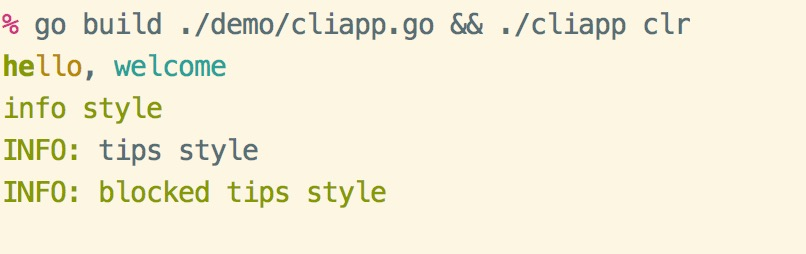

# cliapp 

simple cliapp for golang

- auto generate help info
- support add multi commands
- support command alias
- support for running a command independently
- support var replace on display help info
- support color tag on display help info
- support cli color, simple to use. like `<info>info style</>`

## install

- use dep

```bash
dep ensure -add github.com/golangkit/cliapp
```

- go get

```bash
go get -u github.com/golangkit/cliapp
```

## quick start

```go 
package main

import (
    "runtime"
    "github.com/golangkit/cliapp"
    "github.com/golangkit/cliapp/demo/cmd"
)

// for test run: go build ./demo/cliapp.go && ./cliapp
func main() {
    runtime.GOMAXPROCS(runtime.NumCPU())

    app := cliapp.NewApp()
    app.Version = "1.0.3"
    app.Verbose = cliapp.VerbDebug
    app.Description = "this is my cli application"

    app.Add(cmd.ExampleCommand())
    app.Add(cmd.GitCommand())
    app.Add(&cliapp.Command{
        Name: "demo",
        Aliases: []string{"dm"},
        // allow color tag and {$cmd} will be replace to 'demo'
        Description: "this is a description <info>message</>  for {$cmd}", 
        Fn: func (cmd *cliapp.Command, args []string) int {
            cliapp.Stdout("hello, in the demo command\n")
            return 0
        },
    })

    // .... add more ...

    app.Run()
}
```

## Usage

- build a demo package 

```bash
% go build ./demo/cliapp.go                                                           
```

### display app version

```bash
% ./cliapp --version
this is my cli application

Version: 1.0.3                                                           
```

### display app help

```bash
% ./cliapp                                                            
this is my cli application
Usage:
  ./cliapp command [--option ...] [argument ...]

Options:
  -h, --help        Display this help information
  -V, --version     Display this version information

Commands:
  demo         this is a description message for demo(alias: dm)
  help         display help information

Use "./cliapp help [command]" for more information about a command

```

### run a command

```bash
% ./cliapp example --id 12 -c val ag0 ag1                          
hello, in example command
opts {id:12 c:val dir:}
args is [ag0 ag1]

```

### display command help

```bash
% ./cliapp example -h                                                
this is a description message

Name: example(alias: exp,ex)
Usage: ./cliapp example [--option ...] [argument ...]

Global Options:
  -h, --help        Display this help information

Options:
  -c string
        the short option (default value)
  --dir string
        the dir option
  --id int
        the id option (default 2)

Arguments:
  arg0        the first argument
  arg1        the second argument
 
Examples:
  ./cliapp example --id 12 -c val ag0 ag1

```

## Use Color

```go
package main

import (
    "github.com/golangkit/cliapp/color"
    )

func main() {
	// simple usage
	color.FgCyan.Printf("Simple to use %s\n", "color")

	// custom color
	color.New(color.FgWhite, color.BgBlack).Println("custom color style")

	// use style tag
	color.Print("<suc>he</><comment>llo</>, <cyan>wel</><red>come</>\n")

	// set a style tag
	color.Tag("info").Println("info style text")

	// use info style tips
	color.Tips("info").Print("tips style text\n")

	// use info style blocked tips
	color.BlockTips("info").Print("blocked tips style text\n")
}
```

output:



### More Methods

- use like html tag

```go
	// use style tag
	color.Print("<suc>he</><comment>llo</>, <cyan>wel</><red>come</>")
	color.Println("<suc>hello</>")
	color.Println("<error>hello</>")
	color.Println("<warning>hello</>")

	// custom color attributes
	color.Print("<fg=yellow;bg=black;op=underscore;>hello, welcome</>\n")
```

- `color.Tag`

```go
	// set a style tag
	color.Tag("info").Print("info style text")
	color.Tag("info").Printf("%s style text", "info")
	color.Tag("info").Println("info style text")
```

### Internal Tags

```go
// Some internal defined style tags
// format is: "fg;bg;opt"
// usage: <tag>content text</>
var TagColors = map[string]string{
	// basic tags
	"red":     "0;31",
	"blue":    "0;34",
	"cyan":    "0;36",
	"black":   "0;30",
	"green":   "0;32",
	"brown":   "0;33",
	"white":   "1;37",
	"default": "39", // no color
	"normal":  "39", // no color
	"yellow":  "1;33",
	"magenta": "1;35",

	// alert tags, like bootstrap's alert
	"suc":     "1;32", // same "green" and "bold"
	"success": "1;32",
	"info":    "0;32", // same "green",
	"comment": "0;33", // same "brown"
	"note":    "36;1",
	"notice":  "36;4",
	"warn":    "0;30;43",
	"warning": "0;30;43",
	"primary": "0;34",
	"danger":  "0;31", // same "red"
	"err":     "30;41",
	"error":   "30;41",

	// more tags
	"lightRed":      "1;31",
	"light_red":     "1;31",
	"lightGreen":    "1;32",
	"light_green":   "1;32",
	"lightBlue":     "1;34",
	"light_blue":    "1;34",
	"lightCyan":     "1;36",
	"light_cyan":    "1;36",
	"lightDray":     "37",
	"light_gray":    "37",
	"darkDray":      "90",
	"dark_gray":     "90",
	"lightYellow":   "93",
	"light_yellow":  "93",
	"lightMagenta":  "95",
	"light_magenta": "95",

	// extra
	"lightRedEx":     "91",
	"light_red_ex":   "91",
	"lightGreenEx":   "92",
	"light_green_ex": "92",
	"lightBlueEx":    "94",
	"light_blue_ex":  "94",
	"lightCyanEx":    "96",
	"light_cyan_ex":  "96",
	"whiteEx":        "97",
	"white_ex":       "97",

	// option
	"bold":       "1",
	"underscore": "4",
	"reverse":    "7",
}
```

## [godoc](https://godoc.org/github.com/golangkit/cliapp)

## Ref

- `issue9/term` https://github.com/issue9/term
- `beego/bee` https://github.com/beego/bee

## License

MIT
