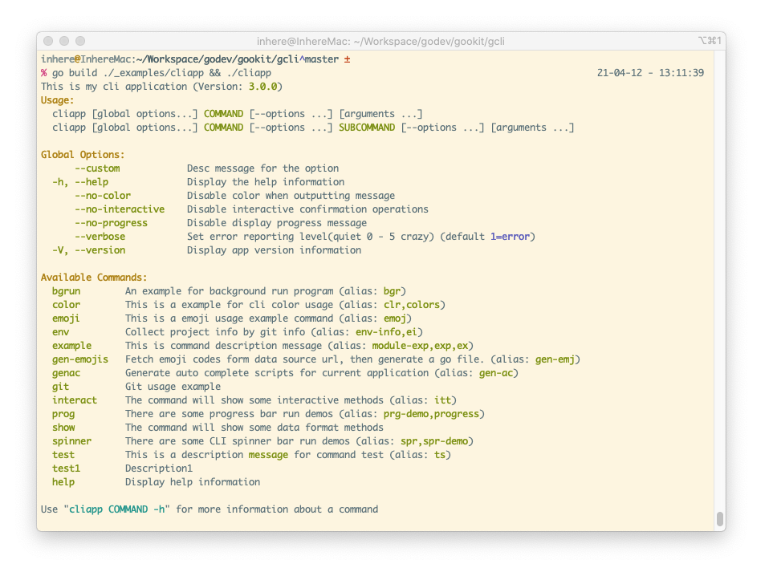
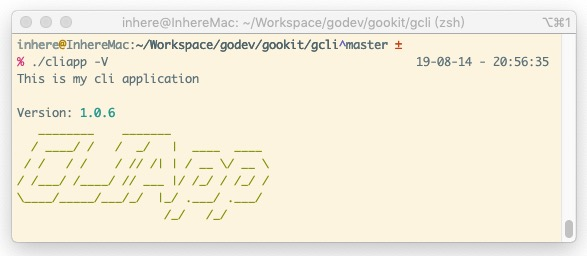
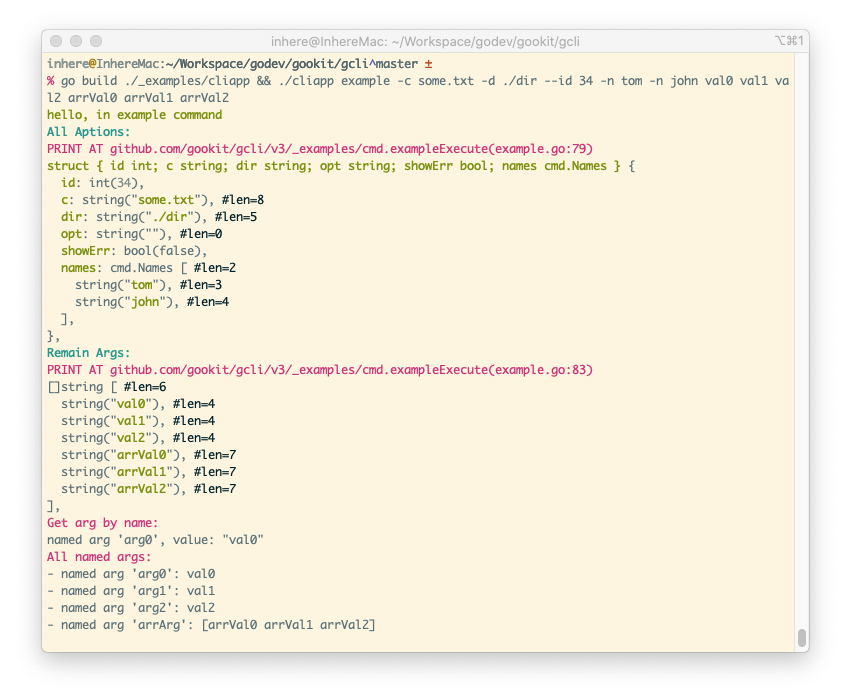
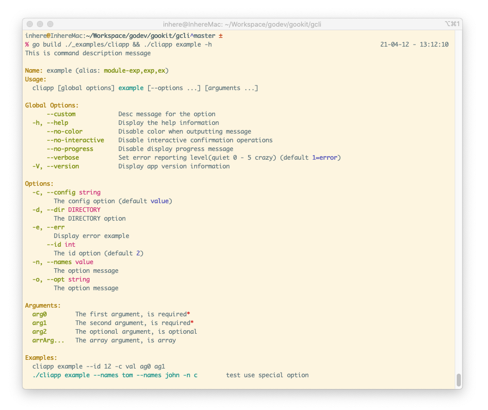
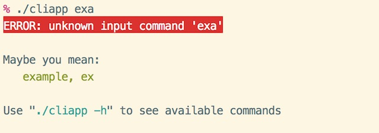
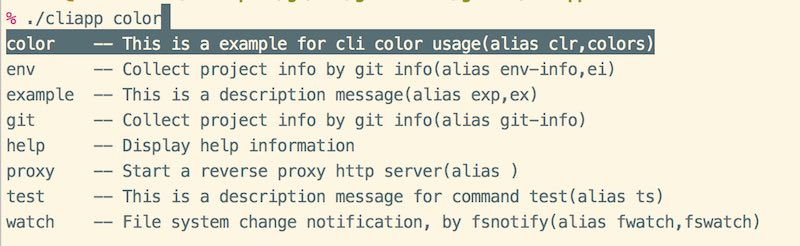

# GCli 


[](https://github.com/gookit/gcli/actions)
[](https://github.com/gookit/gcli)
[](https://www.codacy.com/gh/gookit/gcli/dashboard?utm_source=github.com&amp;utm_medium=referral&amp;utm_content=gookit/gcli&amp;utm_campaign=Badge_Grade)
[](https://pkg.go.dev/github.com/gookit/goutil)
[](https://goreportcard.com/report/github.com/gookit/gcli)
[](https://coveralls.io/github/gookit/gcli?branch=master)

A simple and easy-to-use command-line application and tool library written in Golang.
Including running commands, color styles, data display, progress display, interactive methods, etc.

## [中文说明](README.zh-CN.md)

中文说明请看 **[README.zh-CN](README.zh-CN.md)**

## Screenshots



## Features

Rich in functions and easy to use. Highlights grouped by area:

**Commands**

- Multi-level (nested) commands, each level binds its own options
- Command **aliases** and similar-command tips on typo (alias-aware)
- Command/App middleware via `Use(handlers ...RunnerFunc)`
- A single command can run as a stand-alone application

**Option binding**

- Code-style binders: `BoolOpt / IntOpt / StrOpt / Float64Opt / VarOpt ...`
- Generic, type-safe binders: `gflag.Opt[T]` / `gflag.BindVar[T]` — one call covers
  `bool/int/uint/float/string`, `time.Duration`, `[]string/[]int/[]bool`, `map[string]string`
- Struct-tag binding via `FromStruct`:
    - three tag rules: `named`(default) / `simple` / `field`(field name + auto-expand anonymous structs)
    - field types: `bool/int/uint/float/string`, native `[]string/[]int/[]bool` (repeatable), `time.Duration`, `map[string]string` (repeatable `--meta k=v`)
    - `enum:"a,b,c"` tag for value candidates(completion) + membership validation
- `Required` / `Validator` / `Choices` per option; option `Category` for grouped help display

**Three-level option model**

- Global (App-level) options
- Shared (inherited) options via `Command.SharedOpts()` (≈ cobra `PersistentFlags`): inherited by the
  command and all its sub-commands (sharing the same variable), grouped under `Inherited Options` in help
- Local (per-command) options

**Parse enhancements**

- Options written **after** arguments are auto-reordered: `cmd arg --name tom` == `cmd --name tom arg`
  (on by default; disable via `gflag.WithReorderArgs(false)`)
- POSIX short-flag combining (`-ab` = `-a -b`) via opt-in `EnhanceShort`; `EnhanceShort=2` also supports
  attached-value form `-Ostdout` = `-O stdout`. Only all-bool groups are split, off by default for compatibility
- Declarative interactive collect by `Question` when the option value is empty

**Arguments**

- Bind named argument, with `required` / optional / `array` settings
- Auto-detected and collected when the command is run

**Tooling**

- Generate `zsh` / `bash` / `pwsh` command completion scripts (incl. dynamic completion)
- Generate `markdown` / `man page` command documentation (`docgen` package + builtin `GenDoc` command)
- Auto-generated, color-rendered command help information
- Event hook system (`gevent`, with `gcli.Evt*` aliases)

**Extras**

- Color output, interactive input and progress/data display, provided by
  [gookit/color](https://github.com/gookit/color) and [gookit/cliui](https://github.com/gookit/cliui)

## GoDoc

- [godoc](https://pkg.go.dev/github.com/gookit/gcli/v3)

## Install

```bash
go get github.com/gookit/gcli/v3
```

> **Upgrade note:** the event package `gcli/v3/events` was renamed to
> `gcli/v3/gevent`. Update your imports, or reference event names directly via the
> `gcli.Evt*` aliases (e.g. `gcli.EvtCmdRunBefore`) to avoid the import entirely.
> See [CHANGELOG](CHANGELOG.md) for details.

## Quick start

an example for quick start:

```go
package main

import (
    "github.com/gookit/gcli/v3"
    "github.com/gookit/gcli/v3/_examples/cmd"
)

// for test run: go build ./_examples/cliapp.go && ./cliapp
func main() {
    app := gcli.NewApp()
    app.Version = "1.0.3"
    app.Desc = "this is my cli application"
    // app.SetVerbose(gcli.VerbDebug)

    // TIP: Add binding app-level option settings (same level as the built-in -h/--help)
    app.Flags().BoolOpt(...)
    app.Flags().StrOpt(...)

    app.Add(cmd.Example)
    app.Add(&gcli.Command{
        Name: "demo",
        // allow color tag and {$cmd} will be replace to 'demo'
        Desc: "this is a description <info>message</> for {$cmd}", 
        Subs: []*gcli.Command {
            // ... allow add subcommands
        },
        Aliases: []string{"dm"},
        Func: func (cmd *gcli.Command, args []string) error {
            gcli.Print("hello, in the demo command\n")
            return nil
        },
    })

    // .... add more ...

    app.Run(nil)
}
```

## Binding flags

flags binding and manage by builtin `gflag.go`, allow binding flag options and arguments.

### Bind options

gcli support multi method to binding flag options.

#### Use flag methods

Available methods:

```go
BoolOpt(p *bool, name, shorts string, defValue bool, desc string)
BoolVar(p *bool, meta FlagMeta)
Float64Opt(p *float64, name, shorts string, defValue float64, desc string)
Float64Var(p *float64, meta FlagMeta)
Int64Opt(p *int64, name, shorts string, defValue int64, desc string)
Int64Var(p *int64, meta FlagMeta)
IntOpt(p *int, name, shorts string, defValue int, desc string)
IntVar(p *int, meta FlagMeta)
StrOpt(p *string, name, shorts, defValue, desc string)
StrVar(p *string, meta FlagMeta)
Uint64Opt(p *uint64, name, shorts string, defValue uint64, desc string)
Uint64Var(p *uint64, meta FlagMeta)
UintOpt(p *uint, name, shorts string, defValue uint, desc string)
UintVar(p *uint, meta FlagMeta)
Var(p flag.Value, meta FlagMeta)
VarOpt(p flag.Value, name, shorts, desc string)
```

Usage examples:

```go
var id int
var b bool
var opt, dir string
var f1 float64
var names gcli.Strings

// bind options
cmd.IntOpt(&id, "id", "", 2, "the id option")
cmd.BoolOpt(&b, "bl", "b", false, "the bool option")
// notice `DIRECTORY` will replace to option value type
cmd.StrOpt(&dir, "dir", "d", "", "the `DIRECTORY` option")
// setting option name and short-option name
cmd.StrOpt(&opt, "opt", "o", "", "the option message")
// setting a special option var, it must implement the flag.Value interface
cmd.VarOpt(&names, "names", "n", "the option message")
```

#### Use generic binders

`gflag.Opt[T]` / `gflag.BindVar[T]` bind a typed pointer in one type-safe call,
covering scalars, `time.Duration`, slices and `map[string]string`:

```go
var name string
var tags []string

gflag.Opt(cmd.Flags(), &name, "name", "n", "tom", "the user name")
// slice option, repeatable: --tag php --tag go
gflag.Opt(cmd.Flags(), &tags, "tag", "t", nil, "the tags, repeatable")
```

#### Use struct tags

```go
package main

import (
	"github.com/gookit/gcli/v3"
)

type userOpts struct {
	Int  int    `flag:"name=int0;shorts=i;required=true;desc=int option message"`
	Bol  bool   `flag:"name=bol;shorts=b;desc=bool option message"`
	Str1 string `flag:"name=str1;shorts=o;required=true;desc=str1 message"`
	// use ptr
	Str2 *string `flag:"name=str2;required=true;desc=str2 message"`
	// custom type and implement flag.Value
	Verb0 gcli.VerbLevel `flag:"name=verb0;shorts=v0;desc=verb0 message"`
	// use ptr
	Verb1 *gcli.VerbLevel `flag:"name=verb1;desc=verb1 message"`
}

// run: go run ./_examples/issues/iss157.go
func main() {
	astr := "xyz"
	verb := gcli.VerbWarn

	cmd := gcli.NewCommand("test", "desc")
	cmd.Config = func(c *gcli.Command) {
		c.MustFromStruct(&userOpts{
			Str2:  &astr,
			Verb1: &verb,
		})
	}

	// disable auto bind global options: verbose,version, progress...
	gcli.GOpts().SetDisable()

	// direct run
	if err := cmd.Run(nil); err != nil {
		colorp.Errorln( err)
	}
}
```

#### Struct tag rules

`FromStruct` supports three tag rules, selected by `c.FromStruct(ptr, ruleType)`:

- `gcli.TagRuleNamed` (default): `flag:"name=int0;shorts=i;required=true;desc=message"`
- `gcli.TagRuleSimple`: `flag:"desc;required;default;shorts"`
- `gcli.TagRuleField`: use the **field name** (SnakeCase) as the option name, read meta
  from independent tag keys. **Anonymous nested structs are expanded** automatically.

```go
type commonOpts struct {
	Verbose bool `flag:"v" desc:"enable verbose output"`
}
type demoOpts struct {
	commonOpts        // anonymous: expands to a --verbose/-v option
	UserName string `flag:"u" desc:"the user name" required:"true"`
	Age      int    `desc:"the user age" default:"18"`
}

c.MustFromStruct(&demoOpts{}, gcli.TagRuleField)
// => options: --user-name/-u (required), --age (default 18), --verbose/-v
```

#### Interactive collect by Question

When an option value is empty, you can auto-collect it via an interactive question
(a built-in default collector). `Collector` has higher priority than `Question`.

```go
c.StrOpt2(&token, "token", "the access token",
	gflag.WithQuestion("Please input your access token: "))
// run without --token will prompt: "Please input your access token: "
```

#### POSIX short option enhance

Combined short options are disabled by default. Enable via `Config.EnhanceShort`:

```go
c.ParserCfg().EnhanceShort = gcli.EnhanceShortMerge  // 1: -aux => -a -u -x (all bool)
c.ParserCfg().EnhanceShort = gcli.EnhanceShortAttach // 2: also -Ostdout => -O stdout
```

Or enable it **globally** for all commands with one call — a command's own setting
(if any) still takes priority:

```go
gcli.SetEnhanceShort(gcli.EnhanceShortMerge) // applies to every command
```

Only groups where **all** members are bool short options are split; mixed forms are kept
as-is to avoid mis-parsing value-taking short options.

> Runnable demos in `_examples/cmd`: `struct-flag` (B6), `short-merge` (B4+B5), `ask-demo` (B7).

### Command/Option category

Both commands and options support a `Category` for grouped display in the help
message. When no category is set, the output is the same as before (commands go
to `Available Commands`, options are listed directly under `Options:`).

```go
// command category
app.Add(&gcli.Command{Name: "migrate", Desc: "run db migrate", Category: "database"})
app.Add(&gcli.Command{Name: "serve", Desc: "start http server"}) // default group

// option category
cmd.StrVar(&dsn, &gcli.CliOpt{Name: "db-dsn", Desc: "database dsn", Category: "database"})
cmd.StrOpt2(&port, "port", "bind port", gflag.WithCategory("network"))
```

Groups keep the order of first appearance; commands inside a group are sorted by name.

> NOTE: the log level is no longer controlled by a global `--verbose` option.
> Use the env `GCLI_VERBOSE` (eg `GCLI_VERBOSE=debug`) or `gcli.SetVerbose()` instead,
> so it won't pollute the option list of the host application.

### Bind arguments

**About arguments**:

- Required argument cannot be defined after optional argument
- Support binding array argument
- The (array)argument of multiple values can only be defined at the end

Available methods:

```go
Add(arg Argument) *Argument
AddArg(name, desc string, requiredAndArrayed ...bool) *Argument
AddArgByRule(name, rule string) *Argument
AddArgument(arg *Argument) *Argument
BindArg(arg Argument) *Argument
```

Usage examples:

```go
cmd.AddArg("arg0", "the first argument, is required", true)
cmd.AddArg("arg1", "the second argument, is required", true)
cmd.AddArg("arg2", "the optional argument, is optional")
cmd.AddArg("arrArg", "the array argument, is array", false, true)
```

can also use `Arg()/BindArg()` add a gcli.Argument object:

```go
cmd.Arg("arg0", gcli.Argument{
	Name: "ag0",
	Desc: "the first argument, is required",
	Require: true,
})
cmd.BindArg("arg2", gcli.Argument{
	Name: "ag0",
	Desc: "the third argument, is is optional",
})
cmd.BindArg("arrArg", gcli.Argument{
	Name: "arrArg",
	Desc: "the third argument, is is array",
	Arrayed: true,
})
```

use `AddArgByRule`:

```go
cmd.AddArgByRule("arg2", "add an arg by string rule;required;23")
```

## New application

```go
app := gcli.NewApp()
app.Version = "1.0.3"
app.Desc = "this is my cli application"
// app.SetVerbose(gcli.VerbDebug)
```

## Add commands

```go
app.Add(cmd.Example)
app.Add(&gcli.Command{
    Name: "demo",
    // allow color tag and {$cmd} will be replace to 'demo'
    Desc: "this is a description <info>message</> for {$cmd}", 
    Subs: []*gcli.Command {
        // level1: sub commands...
    	{
            Name:    "remote",
            Desc:    "remote command for git",
            Aliases: []string{"rmt"},
            Func: func(c *gcli.Command, args []string) error {
                dump.Println(c.Path())
                return nil
            },
            Subs: []*gcli.Command{
                // level2: sub commands...
                // {}
            }
        },
        // ... allow add subcommands
    },
    Aliases: []string{"dm"},
    Func: func (cmd *gcli.Command, args []string) error {
        gcli.Print("hello, in the demo command\n")
        return nil
    },
})
```

## Run application

Build the example application as demo

```bash
$ go build ./_examples/cliapp                                                         
```

**Display version**

```bash
$ ./cliapp --version      
# or use -V                                                 
$ ./cliapp -V                                                     
```



**Display app help**

> by `./cliapp` or `./cliapp -h` or `./cliapp --help`

Examples:

```bash
./cliapp
./cliapp -h # can also
./cliapp --help # can also
```


 **Run command**

Format:

```bash
./cliapp COMMAND [--OPTION VALUE -S VALUE ...] [ARGUMENT0 ARGUMENT1 ...]
./cliapp COMMAND [--OPTION VALUE -S VALUE ...] SUBCOMMAND [--OPTION ...] [ARGUMENT0 ARGUMENT1 ...]
```

Run example:

```bash
$ ./cliapp example -c some.txt -d ./dir --id 34 -n tom -n john val0 val1 val2 arrVal0 arrVal1 arrVal2
```

You can see:



**Display command help**

> by `./cliapp example -h` or `./cliapp example --help`



**Error command tips**



## Generate Auto Completion Scripts

```go
import  "github.com/gookit/gcli/v3/builtin"

    // ...
    // add gen command(gen successful you can remove it)
    app.Add(builtin.GenAutoComplete())

```

Build and run command(_This command can be deleted after success._)：

```bash
$ go build ./_examples/cliapp.go && ./cliapp genac -h // display help
$ go build ./_examples/cliapp.go && ./cliapp genac // run gen command
```

will see:

```text
INFO: 
  {shell:zsh binName:cliapp output:auto-completion.zsh}

Now, will write content to file auto-completion.zsh
Continue? [yes|no](default yes): y

OK, auto-complete file generate successful
```

> After running, it will generate an `auto-completion.{zsh|bash}` file in the current directory,
 and the shell environment name is automatically obtained.
 Of course, you can specify it manually at runtime

Generated shell script file ref： 

- bash env [auto-completion.bash](resource/auto-completion.bash) 
- zsh env [auto-completion.zsh](resource/auto-completion.zsh)

Preview: 



## Shared (inherited) options

`Command.SharedOpts()` (≈ cobra `PersistentFlags`) binds options that are inherited by the
command **and all of its sub-commands**, sharing the same variable. They can be written at any
position in the sub-command segment and are grouped under `Inherited Options` in the help output.

```go
var gitDir string

top := &gcli.Command{Name: "git", Desc: "git tools"}
// bind on SharedOpts: inherited by every sub-command
top.SharedOpts().StrOpt(&gitDir, "git-dir", "", ".git", "the git dir path")

top.Add(&gcli.Command{
    Name: "status",
    Func: func(c *gcli.Command, _ []string) error {
        // --git-dir is usable here even though it is declared on the parent
        gcli.Printf("git dir: %s\n", gitDir)
        return nil
    },
})

// usage: ./app git status --git-dir /path/to/.git
```

## Generate command docs

Add the builtin `GenDoc` command, then export `markdown` / `man` documentation for all commands:

```go
import "github.com/gookit/gcli/v3/builtin"

app.Add(builtin.GenDoc())
// ./cliapp gendoc -f md  -o ./docs   # export markdown (default)
// ./cliapp gendoc -f man -o ./docs   # export man pages
```

You can also call it programmatically:

```go
import "github.com/gookit/gcli/v3/docgen"

docgen.MarkdownTree(app, "./docs") // one .md per command + index.md
docgen.ManTree(app, "./docs")      // man pages
```

## Write a command

command allow setting fields:

- `Name` the command name.
- `Desc` the command description.
- `Aliases` the command alias names.
- `Config` the command config func, will call it on init.
- `Subs` add subcommands, allow multi level subcommands
- `Func` the command handle callback func
- More, please see [godoc](https://pkg.go.dev/github.com/gookit/gcli/v3)

### Quick create

```go
var MyCmd = &gcli.Command{
    Name: "demo",
    // allow color tag and {$cmd} will be replace to 'demo'
    Desc: "this is a description <info>message</> for command {$cmd}", 
    Aliases: []string{"dm"},
    Func: func (cmd *gcli.Command, args []string) error {
        gcli.Print("hello, in the demo command\n")
        return nil
    },
    // allow add multi level subcommands
    Subs: []*gcli.Command{},
}
```

### Write go file

> the source file at: [example.go](_examples/cmd/example.go)

```go
package main

import (
	"fmt"

	"github.com/gookit/color"
	"github.com/gookit/gcli/v3"
	"github.com/gookit/goutil/dump"
)

// options for the command
var exampleOpts = struct {
	id  int
	c   string
	dir string
	opt string
	names gcli.Strings
}{}

// ExampleCommand command definition
var ExampleCommand = &gcli.Command{
	Name: "example",
	Desc: "this is a description message",
	Aliases: []string{"exp", "ex"}, // 命令别名
	// {$binName} {$cmd} is help vars. '{$cmd}' will replace to 'example'
	Examples: `{$binName} {$cmd} --id 12 -c val ag0 ag1
<cyan>{$fullCmd} --names tom --names john -n c</> test use special option`,
	Config: func(c *gcli.Command) {
	    // binding options
        // ...
        c.IntOpt(&exampleOpts.id, "id", "", 2, "the id option")
		c.StrOpt(&exampleOpts.c, "config", "c", "value", "the config option")
		// notice `DIRECTORY` will replace to option value type
		c.StrOpt(&exampleOpts.dir, "dir", "d", "", "the `DIRECTORY` option")
		// 支持设置选项短名称
		c.StrOpt(&exampleOpts.opt, "opt", "o", "", "the option message")
		// 支持绑定自定义变量, 但必须实现 flag.Value 接口
		c.VarOpt(&exampleOpts.names, "names", "n", "the option message")

      // binding arguments
		c.AddArg("arg0", "the first argument, is required", true)
		// ...
	},
	Func:  exampleExecute,
}

// 命令执行主逻辑代码
// example run:
// 	go run ./_examples/cliapp.go ex -c some.txt -d ./dir --id 34 -n tom -n john val0 val1 val2 arrVal0 arrVal1 arrVal2
func exampleExecute(c *gcli.Command, args []string) error {
	color.Infoln("hello, in example command")

	if exampleOpts.showErr {
		return c.NewErrf("OO, An error has occurred!!")
	}

	magentaln := color.Magenta.Println

	color.Cyanln("All Aptions:")
	// fmt.Printf("%+v\n", exampleOpts)
	dump.V(exampleOpts)

	color.Cyanln("Remain Args:")
	// fmt.Printf("%v\n", args)
	dump.P(args)

	magentaln("Get arg by name:")
	arr := c.Arg("arg0")
	fmt.Printf("named arg '%s', value: %#v\n", arr.Name, arr.Value)

	magentaln("All named args:")
	for _, arg := range c.Args() {
		fmt.Printf("- named arg '%s': %+v\n", arg.Name, arg.Value)
	}

	return nil
}
```

- display the command help：

```bash
go build ./_examples/cliapp.go && ./cliapp example -h
```


## Extras: color, interactive & progress

gcli ships with color output, interactive input (`Confirm` / `Select` / `ReadLine` ...),
progress display (`Bar` / `Spinner` / `Loading` ...) and data display (table / list / tree),
provided by [gookit/color](https://github.com/gookit/color) and
[gookit/cliui](https://github.com/gookit/cliui).

```go
color.Info.Tips("processing...")              // colored output

ok := interact.Confirm("ensure continue?")    // interactive confirm
if !ok {
    return nil
}

p := progress.Bar(100)                        // progress bar
p.Start(); /* p.Advance() in loop */ p.Finish()
```

> For more usage see [gookit/color](https://github.com/gookit/color) and [gookit/cliui](https://github.com/gookit/cliui).

## Gookit packages

- [gookit/ini](https://github.com/gookit/ini) Go config management, use INI files
- [gookit/rux](https://github.com/gookit/rux) Simple and fast request router for golang HTTP 
- [gookit/gcli](https://github.com/gookit/gcli) build CLI application, tool library, running CLI commands
- [gookit/event](https://github.com/gookit/event) Lightweight event manager and dispatcher implements by Go
- [gookit/cache](https://github.com/gookit/cache) Generic cache use and cache manager for golang. support File, Memory, Redis, Memcached.
- [gookit/config](https://github.com/gookit/config) Go config management. support JSON, YAML, TOML, INI, HCL, ENV and Flags
- [gookit/color](https://github.com/gookit/color) A command-line color library with true color support, universal API methods and Windows support
- [gookit/filter](https://github.com/gookit/filter) Provide filtering, sanitizing, and conversion of golang data
- [gookit/validate](https://github.com/gookit/validate) Use for data validation and filtering. support Map, Struct, Form data
- [gookit/goutil](https://github.com/gookit/goutil) Some utils for the Go: string, array/slice, map, format, cli, env, filesystem, test and more
- More please see https://github.com/gookit

## See also

- `inhere/console` https://github/inhere/php-console
- `issue9/term` https://github.com/issue9/term
- [ANSI escape code](https://en.wikipedia.org/wiki/ANSI_escape_code)

## License

MIT
