# GCli


[](https://github.com/gookit/gcli/actions)
[](https://github.com/gookit/gcli)
[](https://travis-ci.org/gookit/gcli)
[](https://app.codacy.com/app/inhere/gcli?utm_source=github.com&utm_medium=referral&utm_content=gookit/gcli&utm_campaign=Badge_Grade_Dashboard)
[](https://godoc.org/github.com/gookit/gcli)
[](https://goreportcard.com/report/github.com/gookit/gcli)
[](https://coveralls.io/github/gookit/gcli?branch=master)

一个Golang下的简单易用的命令行应用，工具库。包含运行命令，颜色风格，数据展示，进度显示，交互方法等

> **[EN Readme](README.md)**

## 截图展示

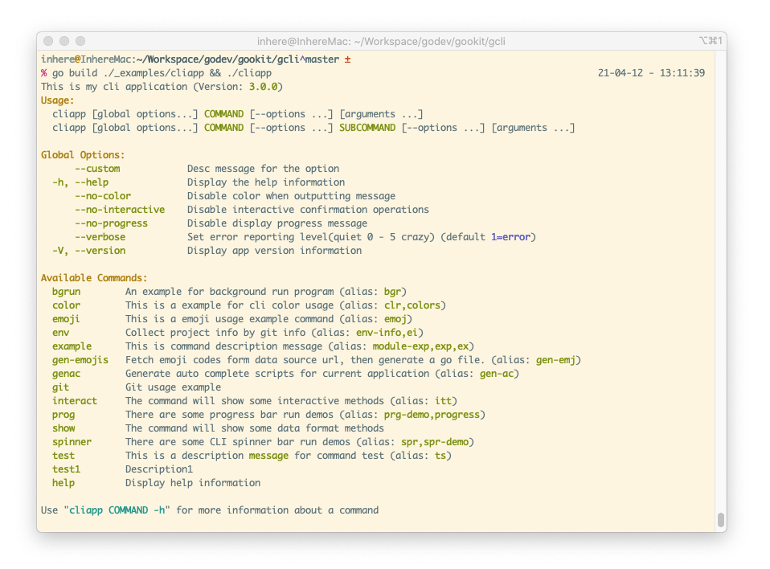

## 功能特色

- 使用简单方便，轻量级，功能丰富
- 支持添加多个命令，并且支持给命令添加别名
- 输入的命令错误时，将会提示相似命令（包含别名提示）
- 快速方便的添加选项绑定 `--long`，支持添加短选项 `-s`
- 支持绑定参数到指定名称, 支持必须`required`，可选，数组`isArray` 三种设定
  - 运行命令时将会自动检测，并按对应关系收集参数
- 支持丰富的颜色渲染输出, 由[gookit/color](https://github.com/gookit/color)提供
  - 同时支持html标签式的颜色渲染，兼容Windows
  - 内置`info,error,success,danger`等多种风格，可直接使用
- 内置提供用户交互方法: `ReadLine`, `Confirm`, `Select`, `MultiSelect` 等
- 内置提供进度显示方法: `Txt`, `Bar`, `Loading`, `RoundTrip`, `DynamicText` 等
- 自动根据命令生成帮助信息，并且支持颜色显示
- 支持为当前CLI应用生成 `zsh`,`bash` 下的命令补全脚本文件
- 支持将单个命令当做独立应用运行

## GoDoc

- [godoc for gopkg](https://godoc.org/gopkg.in/gookit/gcli.v2)
- [godoc for github](https://godoc.org/github.com/gookit/gcli)

## 安装

```bash
go get github.com/gookit/gcli/v2
```

## 快速开始

如下，引入当前包就可以快速的编写cli应用了

```go 
package main

import (
    "runtime"
    "github.com/gookit/gcli/v2"
    "github.com/gookit/gcli/v2/_examples/cmd"
)

// 测试运行: go run ./_examples/cliapp.go && ./cliapp
func main() {
    app := gcli.NewApp()
    app.Version = "1.0.3"
    app.Description = "this is my cli application"
    // app.SetVerbose(gcli.VerbDebug)

    app.Add(cmd.ExampleCommand())
    app.Add(&gcli.Command{
        Name: "demo",
        // allow color tag and {$cmd} will be replace to 'demo'
        UseFor: "this is a description <info>message</> for command", 
        Aliases: []string{"dm"},
        Func: func (cmd *gcli.Command, args []string) error {
            gcli.Println("hello, in the demo command")
            return nil
        },
    })

    // .... add more ...

    app.Run()
}
```

## 使用说明

先使用本项目下的 [demo](_examples/) 示例代码构建一个小的cli demo应用

```bash
% go build ./_examples/cliapp.go                                                           
```

### 打印版本信息

打印我们在创建cli应用时设置的版本信息。如果你还设置了字符LOGO，也会显示出来。

```bash
% ./cliapp --version      
# or use -V                                                 
% ./cliapp -V                                                     
```

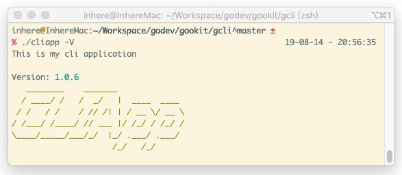

### 应用帮助信息

使用 `./cliapp` 或者 `./cliapp -h` 来显示应用的帮助信息，包含所有的可用命令和一些全局选项

示例：

```bash
./cliapp
./cliapp -h # can also
./cliapp --help # can also
```


### 运行一个命令

```bash
% ./cliapp example -c some.txt -d ./dir --id 34 -n tom -n john val0 val1 val2 arrVal0 arrVal1 arrVal2
```

可以观察到选项和参数的搜集结果:

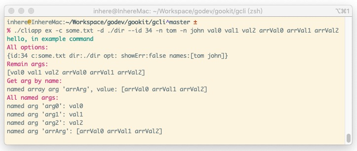

### 显示一个命令的帮助

> by `./cliapp {command} -h` or `./cliapp {command} --help` or `./cliapp help {command}`

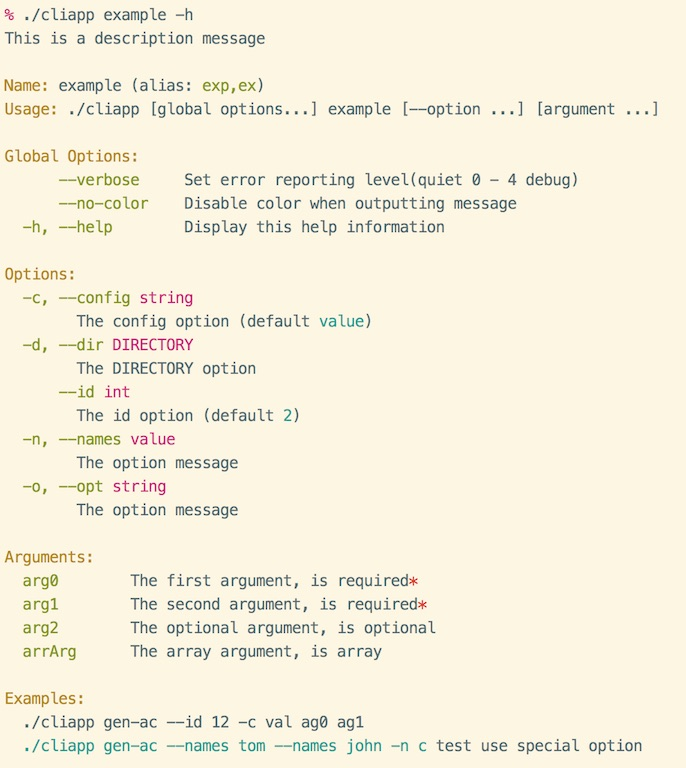

### 相似命令提示

输入了错误的命令，但是有名称相似的会提示出来。

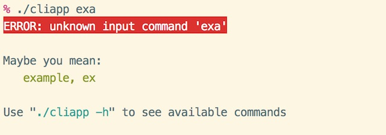

### 生成命令补全脚本

```go
import  "github.com/gookit/gcli/v2/builtin"

    // ...
    // 添加内置提供的生成命令
    app.Add(builtin.GenAutoCompleteScript())

```

构建并运行生成命令(_生成成功后可以去掉此命令_)：

```bash
% go build ./_examples/cliapp.go && ./cliapp genac -h // 使用帮助
% go build ./_examples/cliapp.go && ./cliapp genac // 开始生成, 你将会看到类似的信息
INFO: 
  {shell:zsh binName:cliapp output:auto-completion.zsh}

Now, will write content to file auto-completion.zsh
Continue? [yes|no](default yes): y

OK, auto-complete file generate successful
```

> 运行后就会在当前目录下生成一个 `auto-completion.{zsh|bash}` 文件， shell 环境名是自动获取的。当然你可以在运行时手动指定

生成的shell script 文件请参看： 

- bash 环境 [auto-completion.bash](resource/auto-completion.bash) 
- zsh 环境 [auto-completion.zsh](resource/auto-completion.zsh)

预览效果: 

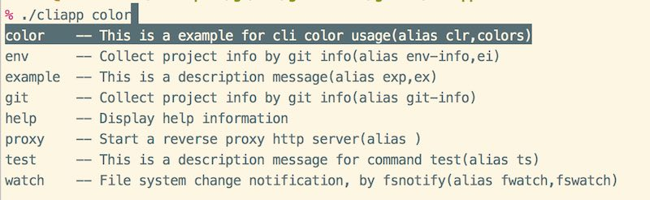

## 编写命令

### 关于参数定义

- 必须的参数不能定义在可选参数之后
- 只允许有一个数组参数（多个值的）
- 数组参数只能定义在最后

### 简单使用

```go
app.Add(&gcli.Command{
    Name: "demo",
    // allow color tag and {$cmd} will be replace to 'demo'
    UseFor: "this is a description <info>message</> for command", 
    Aliases: []string{"dm"},
    Func: func (cmd *gcli.Command, args []string) error {
        gcli.Print("hello, in the demo command\n")
        return nil
    },
})
```

### 使用独立的文件

> the source file at: [example.go](_examples/cmd/example.go)

```go
package cmd

import (
	"fmt"
	"github.com/gookit/color"
	"github.com/gookit/gcli/v2"
)

// options for the command
var exampleOpts = struct {
	id  int
	c   string
	dir string
	opt string
	names gcli.Strings
}{}

// ExampleCommand command definition
func ExampleCommand() *gcli.Command {
	cmd := &gcli.Command{
		Name:        "example",
		UseFor: "this is a description message",
		Aliases:     []string{"exp", "ex"}, // 命令别名
		Func:          exampleExecute,
		// {$binName} {$cmd} is help vars. '{$cmd}' will replace to 'example'
		Examples: `{$binName} {$cmd} --id 12 -c val ag0 ag1
  <cyan>{$fullCmd} --names tom --names john -n c</> test use special option`,
	}

	// 绑定命令选项信息
	cmd.IntOpt(&exampleOpts.id, "id", "", 2, "the id option")
	cmd.StrOpt(&exampleOpts.c, "config", "c", "value", "the config option")
	// notice `DIRECTORY` will replace to option value type
	cmd.StrOpt(&exampleOpts.dir, "dir", "d", "", "the `DIRECTORY` option")
	// 支持设置选项短名称
	cmd.StrOpt(&exampleOpts.opt, "opt", "o", "", "the option message")
	// 支持绑定自定义变量, 但必须实现 flag.Value 接口
	cmd.VarOpt(&exampleOpts.names, "names", "n", "the option message")

	// 绑定命令参数信息，按参数位置绑定
	cmd.AddArg("arg0", "the first argument, is required", true)
	cmd.AddArg("arg1", "the second argument, is required", true)
	cmd.AddArg("arg2", "the optional argument, is optional")
	cmd.AddArg("arrArg", "the array argument, is array", false, true)

	return cmd
}

// 命令执行主逻辑代码
// example run:
// 	go run ./_examples/cliapp.go ex -c some.txt -d ./dir --id 34 -n tom -n john val0 val1 val2 arrVal0 arrVal1 arrVal2
func exampleExecute(c *gcli.Command, args []string) error {
	fmt.Print("hello, in example command\n")

	magentaln := color.Magenta.Println

	magentaln("All options:")
	fmt.Printf("%+v\n", exampleOpts)
	magentaln("Raw args:")
	fmt.Printf("%v\n", args)

	magentaln("Get arg by name:")
	arr := c.Arg("arrArg")
	fmt.Printf("named array arg '%s', value: %v\n", arr.Name, arr.Value)

	magentaln("All named args:")
	for _, arg := range c.Args() {
		fmt.Printf("named arg '%s': %+v\n", arg.Name, *arg)
	}

	return nil
}
```

- 查看此命令的帮助信息：

```bash
go build ./_examples/cliapp.go && ./cliapp example -h
```

> 漂亮的帮助信息就已经自动生成并展示出来了


## 进度显示
 
- `progress.Bar` 通用的进度条

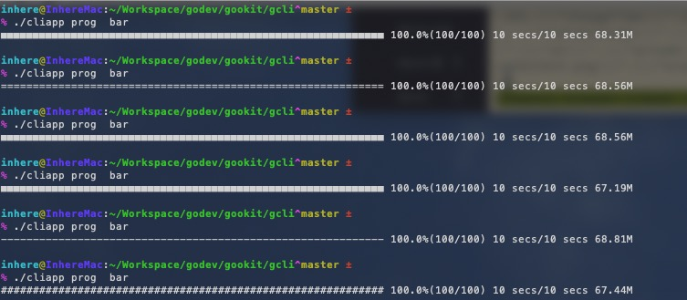

- `progress.Txt` 文本进度条

```text
Data handling ... ... 50% (25/50)
```

- `progress.LoadBar` 加载中

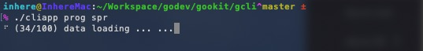

- `progress.Counter` 计数
- `progress.RoundTrip` 来回滚动的进度条 

```text
[===     ] -> [    === ] -> [ ===    ]
```

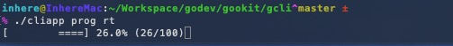

- `progress.DynamicText` 动态消息，执行进度到不同的百分比显示不同的消息

示例:

```go
package main

import "time"
import "github.com/gookit/gcli/v2/progress"

func main()  {
	speed := 100
	maxSteps := 110
	p := progress.Bar(maxSteps)
	p.Start()

	for i := 0; i < maxSteps; i++ {
		time.Sleep(time.Duration(speed) * time.Millisecond)
		p.Advance()
	}

	p.Finish()
}
```

> 更多示例和使用请看 [progress_demo.go](_examples/cmd/progress_demo.go)

运行示例:

```bash
go run ./_examples/cliapp.go prog txt
go run ./_examples/cliapp.go prog bar
go run ./_examples/cliapp.go prog roundTrip
```

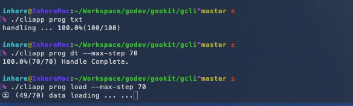

## 交互方法
   
控制台交互方法，包含读取输入，进行确认，单选，多选，询问问题等等

- `interact.ReadInput`
- `interact.ReadLine`
- `interact.ReadFirst`
- `interact.Confirm`
- `interact.Select/Choice`
- `interact.MultiSelect/Checkbox`
- `interact.Question/Ask`
- `interact.ReadPassword`

示例:

```go
package main

import "fmt"
import "github.com/gookit/gcli/v2/interact"

func main() {
	username, _ := interact.ReadLine("Your name?")
	password := interact.ReadPassword("Your password?")
	
	ok := interact.Confirm("ensure continue?")
	if !ok {
		// do something...
	}
    
	fmt.Printf("username: %s, password: %s\n", username, password)
}
```

### 读取输入

```go
ans, _ := interact.ReadLine("Your name? ")

if ans != "" {
    color.Println("Your input: ", ans)
} else {
    color.Cyan.Println("No input!")
}
```

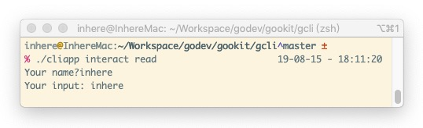

### 单选

```go
	ans := interact.SelectOne(
		"Your city name(use array)?",
		[]string{"chengdu", "beijing", "shanghai"},
		"",
	)
	color.Comment.Println("your select is: ", ans)
```

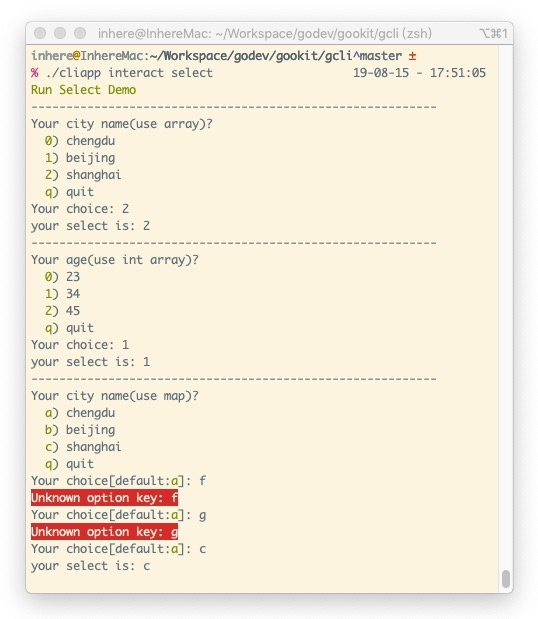

### 多选

```go
	ans := interact.MultiSelect(
		"Your city name(use array)?",
		[]string{"chengdu", "beijing", "shanghai"},
		nil,
	)
	color.Comment.Println("your select is: ", ans)
```

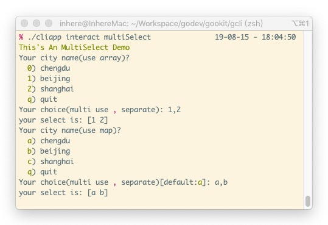

### 确认消息

```go
	if interact.Confirm("Ensure continue") {
		fmt.Println(emoji.Render(":smile: Confirmed"))
	} else {
		color.Warn.Println("Unconfirmed")
	}
```

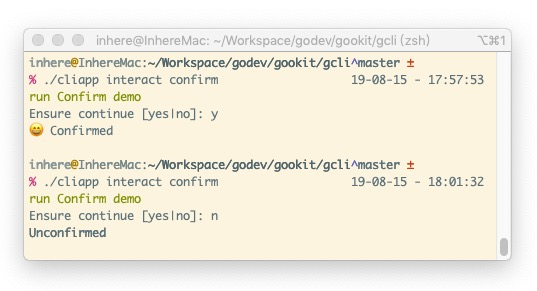

### 读取密码输入

```go
	pwd := interact.ReadPassword()

	color.Comment.Println("your input password is: ", pwd)
```

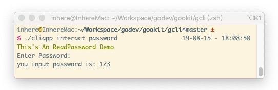

> 更多示例和使用请看 [interact_demo.go](_examples/cmd/interact_demo.go)

## 使用颜色输出

> **颜色输出使用 [gookit/color](https://github.com/gookit/color)**

### 颜色输出展示


### 如何使用

```go
package main

import (
    "github.com/gookit/color"
)

func main() {
	// simple usage
	color.Cyan.Printf("Simple to use %s\n", "color")

	// internal theme/style:
	color.Info.Tips("message")
	color.Info.Prompt("message")
	color.Info.Println("message")
	color.Warn.Println("message")
	color.Error.Println("message")
	
	// custom color
	color.New(color.FgWhite, color.BgBlack).Println("custom color style")

	// can also:
	color.Style{color.FgCyan, color.OpBold}.Println("custom color style")
	
	// use defined color tag
	color.Print("use color tag: <suc>he</><comment>llo</>, <cyan>wel</><red>come</>\n")

	// use custom color tag
	color.Print("custom color tag: <fg=yellow;bg=black;op=underscore;>hello, welcome</>\n")

	// set a style tag
	color.Tag("info").Println("info style text")

	// prompt message
	color.Info.Prompt("prompt style message")
	color.Warn.Prompt("prompt style message")

	// tips message
	color.Info.Tips("tips style message")
	color.Warn.Tips("tips style message")
}
```

### 构建风格

```go
// 仅设置前景色
color.FgCyan.Printf("Simple to use %s\n", "color")
// 仅设置背景色
color.BgRed.Printf("Simple to use %s\n", "color")

// 完全自定义 前景色 背景色 选项
style := color.New(color.FgWhite, color.BgBlack, color.OpBold)
style.Println("custom color style")

// can also:
color.Style{color.FgCyan, color.OpBold}.Println("custom color style")
```

### 使用内置风格

#### 基础颜色

> 支持在windows `cmd.exe` 使用

- `color.Bold`
- `color.Black`
- `color.White`
- `color.Gray`
- `color.Red`
- `color.Green`
- `color.Yellow`
- `color.Blue`
- `color.Magenta`
- `color.Cyan`

```go
color.Bold.Println("bold message")
color.Yellow.Println("yellow message")
```

#### 扩展风格主题 

> 支持在windows `cmd.exe` 使用

- `color.Info`
- `color.Note`
- `color.Light`
- `color.Error`
- `color.Danger`
- `color.Notice`
- `color.Success`
- `color.Comment`
- `color.Primary`
- `color.Warning`
- `color.Question`
- `color.Secondary`

```go
color.Info.Println("Info message")
color.Success.Println("Success message")
```

#### 使用颜色html标签

> **支持** 在windows `cmd.exe` `powerShell` 使用颜色标签

使用颜色标签可以非常方便简单的构建自己需要的任何格式

```go
// 使用内置的 color tag
color.Print("<suc>he</><comment>llo</>, <cyan>wel</><red>come</>")
color.Println("<suc>hello</>")
color.Println("<error>hello</>")
color.Println("<warning>hello</>")

// 自定义颜色属性
color.Print("<fg=yellow;bg=black;op=underscore;>hello, welcome</>\n")
```

> **更多关于颜色库的使用请访问 [gookit/color](https://github.com/gookit/color)**

## Gookit 工具包

- [gookit/ini](https://github.com/gookit/ini) INI配置读取管理，支持多文件加载，数据覆盖合并, 解析ENV变量, 解析变量引用
- [gookit/rux](https://github.com/gookit/rux) Simple and fast request router for golang HTTP 
- [gookit/gcli](https://github.com/gookit/gcli) Go的命令行应用，工具库，运行CLI命令，支持命令行色彩，用户交互，进度显示，数据格式化显示
- [gookit/event](https://github.com/gookit/event) Go实现的轻量级的事件管理、调度程序库, 支持设置监听器的优先级, 支持对一组事件进行监听
- [gookit/cache](https://github.com/gookit/cache) 通用的缓存使用包装库，通过包装各种常用的驱动，来提供统一的使用API
- [gookit/config](https://github.com/gookit/config) Go应用配置管理，支持多种格式（JSON, YAML, TOML, INI, HCL, ENV, Flags），多文件加载，远程文件加载，数据合并
- [gookit/color](https://github.com/gookit/color) CLI 控制台颜色渲染工具库, 拥有简洁的使用API，支持16色，256色，RGB色彩渲染输出
- [gookit/filter](https://github.com/gookit/filter) 提供对Golang数据的过滤，净化，转换
- [gookit/validate](https://github.com/gookit/validate) Go通用的数据验证与过滤库，使用简单，内置大部分常用验证、过滤器
- [gookit/goutil](https://github.com/gookit/goutil) Go 的一些工具函数，格式化，特殊处理，常用信息获取等
- 更多请查看 https://github.com/gookit

## 参考项目

- `issue9/term` https://github.com/issue9/term
- `beego/bee` https://github.com/beego/bee
- `inhere/console` https://github/inhere/php-console
- [ANSI转义序列](https://zh.wikipedia.org/wiki/ANSI转义序列)
- [Standard ANSI color map](https://conemu.github.io/en/AnsiEscapeCodes.html#Standard_ANSI_color_map)
- go package: `golang.org/x/crypto/ssh/terminal`

## License

MIT
