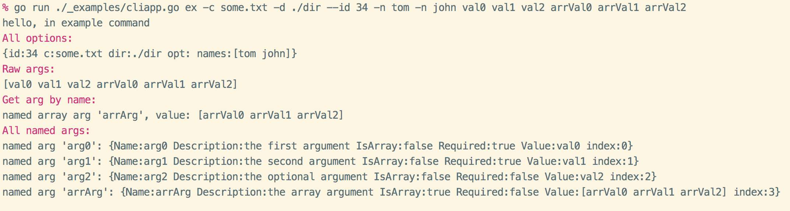

# cliapp

一个golang下的简单易用的命令行应用，工具库。

**[EN Readme](README.md)**

## 功能特色

- 使用简单方便
- 支持添加多个命令，并且支持命令别名
- 输入的命令错误时，将会提示相似命令（包含别名提示）
- 快速方便的添加选项绑定 `--long`，支持添加短选项 `-s`
- 支持绑定参数到指定名称, 支持必须`required`，可选，数组`isArray` 三种设定
  - 运行命令时将会自动检测，并按对应关系收集参数
- 支持丰富的颜色渲染输出, 由[gookit/color](https://github.com/gookit/color)提供
  - 同时支持html标签式的颜色渲染，兼容Windows
  - 内置`info,error,success,danger`等多种风格，可直接使用
- 内置提供 `ReadLine`, `Confirm`, `Select` 等用户交互方法
- 自动根据命令生成帮助信息，并且支持颜色显示
- 支持为当前CLI应用生成 `zsh`,`bash` 下的命令补全脚本文件
- 支持将单个命令当做独立应用运行

## Godoc

- [godoc for gopkg](https://godoc.org/gopkg.in/gookit/cliapp.v1)
- [godoc for github](https://godoc.org/github.com/gookit/cliapp)

## 获取安装

- 使用 dep 包管理

```bash
dep ensure -add gopkg.in/gookit/cliapp.v1 // 推荐
// OR
dep ensure -add github.com/gookit/cliapp
```

- 使用 go get

```bash
go get gopkg.in/gookit/cliapp.v1 // 推荐
// OR
go get -u github.com/gookit/cliapp
```

## 快速开始

如下，引入当前包就可以快速的编写cli应用了

```bash
import "gopkg.in/gookit/cliapp.v1" // 推荐
// or
import "github.com/gookit/cliapp"
```

```go 
package main

import (
    "runtime"
    "github.com/gookit/cliapp"
    "github.com/gookit/cliapp/_examples/cmd"
)

// for test run: go run ./_examples/cliapp.go && ./cliapp
func main() {
    runtime.GOMAXPROCS(runtime.NumCPU())

    app := cliapp.NewApp()
    app.Version = "1.0.3"
    app.Description = "this is my cli application"
    // app.SetVerbose(cliapp.VerbDebug)

    app.Add(cmd.ExampleCommand())
    app.Add(&cliapp.Command{
        Name: "demo",
        Aliases: []string{"dm"},
        // allow color tag and {$cmd} will be replace to 'demo'
        Description: "this is a description <info>message</> for command", 
        Func: func (cmd *cliapp.Command, args []string) int {
            cliapp.Stdout("hello, in the demo command\n")
            return 0
        },
    })

    // .... add more ...

    app.Run()
}
```

## 使用说明

先使用本项目下的 [demo](_examples/) 示例代码构建一个小的cli demo应用

```bash
% go build ./_examples/cliapp.go                                                           
```

### 打印版本信息

打印我们在创建cli应用时设置的版本信息

```bash
% ./cliapp --version
This is my cli application

Version: 1.0.3                                                           
```

### 应用帮助信息

使用 `./cliapp` 或者 `./cliapp -h` 来显示应用的帮助信息，包含所有的可用命令和一些全局选项


### 运行一个命令

```bash
% ./cliapp example -c some.txt -d ./dir --id 34 -n tom -n john val0 val1 val2 arrVal0 arrVal1 arrVal2
```

you can see:



### 显示一个命令的帮助

> by `./cliapp {command} -h` or `./cliapp {command} --help` or `./cliapp help {command}`


### 生成命令补全脚本

```go
import  "github.com/gookit/cliapp/builtin"

    // ...
    // 添加内置提供的生成命令
    app.Add(builtin.GenAutoCompleteScript())

```

构建并运行生成命令(_生成成功后可以去掉此命令_)：

```bash
% go build ./_examples/cliapp.go && ./cliapp genac -h // 使用帮助
% go build ./_examples/cliapp.go && ./cliapp genac // 开始生成, 你将会看到类似的信息
INFO: 
  {shell:zsh binName:cliapp output:auto-completion.zsh}

Now, will write content to file auto-completion.zsh
Continue? [yes|no](default yes): y

OK, auto-complete file generate successful
```

> 运行后就会在当前目录下生成一个 `auto-completion.{zsh|bash}` 文件， shell 环境名是自动获取的。当然你可以在运行时手动指定

生成的shell script 文件请参看： 

- bash 环境 [auto-completion.bash](resource/auto-completion.bash) 
- zsh 环境 [auto-completion.zsh](resource/auto-completion.zsh)

预览效果: 


## 编写命令

### 关于参数定义

- 必须的参数不能定义在可选参数之后
- 只允许有一个数组参数（多个值的）
- 数组参数只能定义在最后

### 简单使用

```go
app.Add(&cliapp.Command{
    Name: "demo",
    Aliases: []string{"dm"},
    // allow color tag and {$cmd} will be replace to 'demo'
    Description: "this is a description <info>message</> for command", 
    Func: func (cmd *cliapp.Command, args []string) int {
        cliapp.Stdout("hello, in the demo command\n")
        return 0
    },
})
```

### 使用独立的文件

> the source file at: [example.go](_examples/cmd/example.go)

```go
package cmd

import (
	"github.com/gookit/cliapp"
	"github.com/gookit/color"
	"fmt"
)

// options for the command
var exampleOpts = struct {
	id  int
	c   string
	dir string
	opt string
	names cliapp.Strings
}{}

// ExampleCommand command definition
func ExampleCommand() *cliapp.Command {
	cmd := &cliapp.Command{
		Name:        "example",
		Description: "this is a description message",
		Aliases:     []string{"exp", "ex"},
		Func:          exampleExecute,
		// {$binName} {$cmd} is help vars. '{$cmd}' will replace to 'example'
		Examples: `{$binName} {$cmd} --id 12 -c val ag0 ag1
  <cyan>{$fullCmd} --names tom --names john -n c</> test use special option`,
	}

	// bind options
	cmd.IntOpt(&exampleOpts.id, "id", "", 2, "the id option")
	cmd.StrOpt(&exampleOpts.c, "config", "c", "value", "the config option")
	// notice `DIRECTORY` will replace to option value type
	cmd.StrOpt(&exampleOpts.dir, "dir", "d", "", "the `DIRECTORY` option")
	// setting option name and short-option name
	cmd.StrOpt(&exampleOpts.opt, "opt", "o", "", "the option message")
	// setting a special option var, it must implement the flag.Value interface
	cmd.VarOpt(&exampleOpts.names, "names", "n", "the option message")

	// bind args with names
	cmd.AddArg("arg0", "the first argument, is required", true)
	cmd.AddArg("arg1", "the second argument, is required", true)
	cmd.AddArg("arg2", "the optional argument, is optional")
	cmd.AddArg("arrArg", "the array argument, is array", false, true)

	return cmd
}

// command running
// example run:
// 	go run ./_examples/cliapp.go ex -c some.txt -d ./dir --id 34 -n tom -n john val0 val1 val2 arrVal0 arrVal1 arrVal2
func exampleExecute(c *cliapp.Command, args []string) int {
	fmt.Print("hello, in example command\n")

	magentaln := color.Magenta.Println

	magentaln("All options:")
	fmt.Printf("%+v\n", exampleOpts)
	magentaln("Raw args:")
	fmt.Printf("%v\n", args)

	magentaln("Get arg by name:")
	arr := c.Arg("arrArg")
	fmt.Printf("named array arg '%s', value: %v\n", arr.Name, arr.Value)

	magentaln("All named args:")
	for _, arg := range c.Args() {
		fmt.Printf("named arg '%s': %+v\n", arg.Name, *arg)
	}

	return 0
}
```

- 查看此命令的帮助信息：

```bash
go build ./_examples/cliapp.go && ./cliapp example -h
```

> 漂亮的帮助信息就已经自动生成并展示出来了


## 使用颜色输出

### 颜色输出展示


### 如何使用

```go
package main

import (
    "github.com/gookit/color"
)

func main() {
	// simple usage
	color.Cyan.Printf("Simple to use %s\n", "color")

	// internal theme/style:
	color.Info.Tips("message")
	color.Info.Prompt("message")
	color.Info.Println("message")
	color.Warn.Println("message")
	color.Error.Println("message")
	
	// custom color
	color.New(color.FgWhite, color.BgBlack).Println("custom color style")

	// can also:
	color.Style{color.FgCyan, color.OpBold}.Println("custom color style")
	
	// use defined color tag
	color.Print("use color tag: <suc>he</><comment>llo</>, <cyan>wel</><red>come</>\n")

	// use custom color tag
	color.Print("custom color tag: <fg=yellow;bg=black;op=underscore;>hello, welcome</>\n")

	// set a style tag
	color.Tag("info").Println("info style text")

	// use info style tips
	color.Tips("info").Print("tips style text")

	// use info style blocked tips
	color.LiteTips("info").Print("blocked tips style text")
}
```

### 构建风格

```go
// 仅设置前景色
color.FgCyan.Printf("Simple to use %s\n", "color")
// 仅设置背景色
color.BgRed.Printf("Simple to use %s\n", "color")

// 完全自定义 前景色 背景色 选项
style := color.New(color.FgWhite, color.BgBlack, color.OpBold)
style.Println("custom color style")

// can also:
color.Style{color.FgCyan, color.OpBold}.Println("custom color style")
```

```go
// 设置console颜色
color.Set(color.FgCyan)

// 输出信息
fmt.Print("message")

// 重置console颜色
color.Reset()
```

### 使用内置风格

#### 基础颜色

> 支持在windows `cmd.exe` 使用

- `color.Bold`
- `color.Black`
- `color.White`
- `color.Gray`
- `color.Red`
- `color.Green`
- `color.Yellow`
- `color.Blue`
- `color.Magenta`
- `color.Cyan`

```go
color.Bold.Println("bold message")
color.Yellow.Println("yellow message")
```

#### 扩展风格主题 

> 支持在windows `cmd.exe` 使用

- `color.Info`
- `color.Note`
- `color.Light`
- `color.Error`
- `color.Danger`
- `color.Notice`
- `color.Success`
- `color.Comment`
- `color.Primary`
- `color.Warning`
- `color.Question`
- `color.Secondary`

```go
color.Info.Println("Info message")
color.Success.Println("Success message")
```

#### 使用颜色html标签

> **不** 支持在windows `cmd.exe` 使用，但不影响使用，会自动去除颜色标签

使用颜色标签可以非常方便简单的构建自己需要的任何格式

```go
// 使用内置的 color tag
color.Print("<suc>he</><comment>llo</>, <cyan>wel</><red>come</>")
color.Println("<suc>hello</>")
color.Println("<error>hello</>")
color.Println("<warning>hello</>")

// 自定义颜色属性
color.Print("<fg=yellow;bg=black;op=underscore;>hello, welcome</>\n")
```

#### 使用 `color.Tag`

给后面输出的文本信息加上给定的颜色风格标签

```go
// set a style tag
color.Tag("info").Print("info style text")
color.Tag("info").Printf("%s style text", "info")
color.Tag("info").Println("info style text")
```

> **更多关于颜色库的使用请访问 [gookit/color](https://github.com/gookit/color)**

## 参考项目

- `issue9/term` https://github.com/issue9/term
- `beego/bee` https://github.com/beego/bee
- `inhere/console` https://github/inhere/php-console
- [ANSI转义序列](https://zh.wikipedia.org/wiki/ANSI转义序列)
- [Standard ANSI color map](https://conemu.github.io/en/AnsiEscapeCodes.html#Standard_ANSI_color_map)
- go package: `golang.org/x/crypto/ssh/terminal`

## License

MIT
